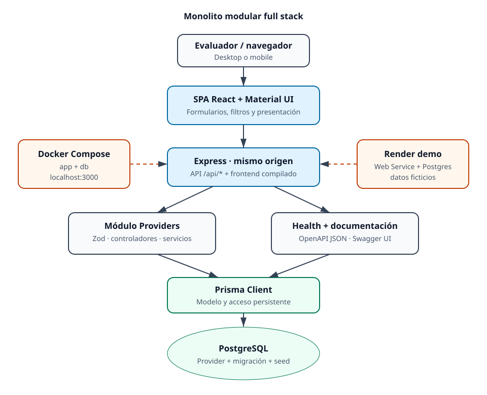

# Arquitectura del sistema

Estado: `VIGENTE` para `main` en V2.2. Esta descripción representa la
implementación existente; no es una arquitectura objetivo.

## Vista general

El producto es un **monolito modular full stack**. React compila una SPA y
Express sirve tanto la interfaz como la API REST desde el mismo origen. Prisma
accede a PostgreSQL. Docker Compose reproduce el entorno local con exactamente
dos servicios, mientras Render aloja una instancia de demostración equivalente.

## Catálogo de diagramas

Cada vista se entrega como fuente Mermaid editable y como imagen SVG/PNG
renderizada. El SVG es el formato principal por su legibilidad al ampliar; el
PNG facilita la descarga y la visualización fuera de GitHub.

| Vista | Propósito | Fuente | SVG | PNG |
|---|---|---|---|---|
| Contexto | Actores, límites y comunicaciones externas | [Mermaid](diagrams/system-context.mmd) | [SVG](diagrams/system-context.svg) | [PNG](diagrams/system-context.png) |
| Contenedores y despliegue | Build, servicios Docker, variables, puertos, health y volumen | [Mermaid](diagrams/container-deployment.mmd) | [SVG](diagrams/container-deployment.svg) | [PNG](diagrams/container-deployment.png) |
| Componentes de aplicación | Responsabilidades internas de frontend, backend y persistencia | [Mermaid](diagrams/application-components.mmd) | [SVG](diagrams/application-components.svg) | [PNG](diagrams/application-components.png) |
| Vista integral | Recorrido resumido por la solución y sus ambientes | [Mermaid](diagrams/system-architecture.mmd) | [SVG](diagrams/system-architecture.svg) | [PNG](diagrams/system-architecture.png) |



## Componentes y límites

| Componente | Responsabilidad | Dependencias directas |
|---|---|---|
| `client/` | Listado, búsqueda, filtros, paginación, formularios, baja lógica, reactivación y presentación responsive | React, Material UI, React Hook Form, Zod y `fetch` |
| `server/src/providers/` | Validación de entrada, normalización, casos de uso y persistencia de prestadores | Express, Zod, Prisma |
| `server/src/health/` | Verificar proceso y conectividad real con PostgreSQL | Prisma |
| `server/src/openapi/` | Publicar OpenAPI JSON y Swagger UI desde el mismo proceso | Swagger UI Express |
| `server/src/middleware/` | Validación de requests y contrato uniforme de errores | Express, Zod |
| `prisma/` | Modelo, migración inicial y seed determinista/idempotente | PostgreSQL |
| `scripts/` | Arranque del contenedor, limpieza y suite con base aislada | Node.js, Docker Compose |

No hay servicios de dominio separados, bus de eventos, cache, almacenamiento de
archivos ni procesos en segundo plano.

### Inventario detallado de componentes

| ID | Capa | Componente | Responsabilidad | Dependencias | Entrada | Salida | Carácter |
|---|---|---|---|---|---|---|---|
| FE-01 | Frontend | `App` | Orquestar pantalla, consulta, estado, diálogos y feedback | React, componentes FE | Interacción y respuestas API | UI actualizada | Obligatorio |
| FE-02 | Frontend | Filtros | Capturar búsqueda por CUIT/razón social y estado | Material UI, debounce | Texto y estado | Parámetros de consulta | Obligatorio |
| FE-03 | Frontend | Tabla/tarjetas | Presentar prestadores en desktop/mobile | Material UI | Lista paginada | Filas o tarjetas accionables | Obligatorio |
| FE-04 | Frontend | Paginación | Navegar páginas estables de diez elementos | API de listado | Página elegida | Nueva consulta | Condicionado aprobado |
| FE-05 | Frontend | Formulario | Alta/edición y validación inmediata | React Hook Form, Zod | Datos del prestador | Payload válido o error | Obligatorio |
| FE-06 | Frontend | Diálogo de estado | Confirmar baja lógica o reactivación | React, Material UI | Prestador y acción | Cambio confirmado/cancelado | Obligatorio |
| FE-07 | Frontend | Cliente API | Ejecutar `GET`, `POST`, `PUT` y `PATCH`; uniformar fallos de red/API | `fetch`, `AbortController` | Parámetros/payload | JSON o error tipado | Obligatorio |
| BE-01 | Backend | Rutas Providers | Vincular métodos y paths con validación/controladores | Express | Request `/api/providers*` | Cadena middleware | Obligatorio |
| BE-02 | Backend | Validación request | Validar query, params y body | Zod | Request HTTP | Datos validados o 400 | Obligatorio |
| BE-03 | Backend | Controladores | Adaptar HTTP a casos de uso | Express, servicio | Datos validados | Response JSON | Obligatorio |
| BE-04 | Backend | Servicio Providers | Aplicar reglas, búsqueda, paginación y mutaciones | Prisma, normalización | Comando/consulta | Provider o página | Obligatorio |
| BE-05 | Backend | Normalización | Canonizar CUIT, teléfono, correo y opcionales | Funciones puras, Zod | Entrada aceptada | Valor persistible | Obligatorio |
| BE-06 | Backend | Middleware de errores | Exponer contrato estable sin stack | Express, `AppError` | Excepción | 400/404/409/500 | Obligatorio |
| BE-07 | Backend | Health | Verificar proceso y conectividad real | Prisma | `GET /api/health` | Estado proceso/base | Obligatorio |
| BE-08 | Backend | Estáticos y SPA | Servir build React y fallback desde mismo origen | Express, `dist/client` | Request no API | HTML/asset | Obligatorio |
| BE-09 | Backend | OpenAPI/Swagger | Publicar contrato HTTP existente | Swagger UI Express | `/api/docs`, JSON | Documentación interactiva | Extra implementado |
| DA-01 | Persistencia | Prisma Client | Acceso tipado y transacción de listado | PostgreSQL | Operación del servicio | Registros/resultado | Obligatorio |
| DA-02 | Persistencia | Modelo `Provider` | Definir entidad, tipos, unicidad e índices | Prisma Schema | Datos canónicos | Esquema relacional | Obligatorio |
| DA-03 | Persistencia | Migración | Crear esquema reproducible | Prisma Migrate | Migración versionada | Base actualizada | Obligatorio |
| DA-04 | Persistencia | Seed | Crear 30 datos ficticios sin duplicar ni borrar ajenos | Prisma | Dataset administrado | Baseline 20/10 | Obligatorio |
| IN-01 | Infraestructura | Servicio `app` | Ejecutar frontend, API, Prisma e inicio controlado | Imagen Node | Puerto 3000, variables | Aplicación saludable | Obligatorio |
| IN-02 | Infraestructura | Servicio `db` | Ejecutar PostgreSQL privado y health check | Imagen PostgreSQL | Variables y volumen | Base saludable | Obligatorio |
| IN-03 | Infraestructura | Volumen `postgres_data` | Conservar datos entre reinicios | Docker | Escrituras PostgreSQL | Datos persistentes | Obligatorio |

## Trazabilidad funcional

| Requisito | UI | API | Servicio/regla | Persistencia | Evidencia de prueba |
|---|---|---|---|---|---|
| Listar prestadores | Tabla/tarjetas | `GET /api/providers` | Listado ordenado y paginado | `findMany` + índices | Integración API y pruebas de `App` |
| Buscar por CUIT o razón social | Buscador con debounce | `GET` con `search` | CUIT sin formato o coincidencia parcial insensible a mayúsculas | Filtro Prisma | Integración de búsquedas y UI |
| Filtrar por estado | Selector de estado | `GET` con `status` | Sólo `ACTIVE` o `INACTIVE` | Campo enum/indexado | Integración de filtro y UI |
| Alta | Formulario | `POST /api/providers` | Valida, normaliza y fuerza `ACTIVE` | `create`; CUIT único | Backend y frontend: alta válida/errores |
| CUIT obligatorio y único | Formulario + mensaje 409 | `POST`/`PUT` | Exactamente 11 dígitos canónicos | `@unique`, `VarChar(11)` | Vacío, formato y duplicado |
| Razón social obligatoria | Formulario | `POST`/`PUT` | Zod rechaza vacío | `VarChar(160)` no nulo | Validaciones frontend/backend |
| Email válido | Formulario | `POST`/`PUT` | Zod valida y normaliza | `VarChar(254)` no nulo | Email inválido y alta válida |
| Modificar | Diálogo de edición | `PUT /api/providers/:id` | Actualiza editables; no cambia estado | `update` por UUID | Integración y UI de edición |
| Baja lógica | Confirmación | `PATCH /api/providers/:id/status` | Cambia a `INACTIVE`; no existe `DELETE` | Registro conservado | Integración y UI de desactivación |
| Reactivar | Confirmación | `PATCH /api/providers/:id/status` | Cambia a `ACTIVE` | Registro existente | Integración y UI de reactivación |
| Paginar | Control de páginas | `GET` con `page/pageSize` | Máximo 100, orden estable | `skip/take` + conteo | Integración y UI de paginación |

## Flujos principales

### Consulta

1. La SPA solicita `GET /api/providers` con búsqueda, estado y paginación.
2. Zod valida y aplica valores por defecto.
3. El servicio construye un filtro Prisma y ejecuta listado y conteo dentro de
   una transacción `RepeatableRead`.
4. La API devuelve `items` y metadatos de paginación; la SPA descarta respuestas
   obsoletas y presenta tabla o tarjetas según el viewport.

### Mutación

1. La SPA valida para feedback inmediato y envía `POST`, `PUT` o `PATCH`.
2. El backend vuelve a validar como límite de confianza y normaliza CUIT,
   correo, opcionales y teléfono.
3. Prisma persiste la operación. Los errores conocidos se traducen al contrato
   estable de la API.
4. La interfaz invalida la consulta visible, informa el resultado y restaura el
   foco. No existe `DELETE`: la baja cambia el estado a `INACTIVE`.

### Arranque

El contenedor espera a PostgreSQL, aplica `prisma migrate deploy`, ejecuta el
seed idempotente e inicia Express. Esta secuencia favorece la demo reproducible,
pero acopla migración y seed al startup; es una limitación aceptada para este
alcance, no un patrón recomendado para producción crítica.

### Ciclo operativo completo

1. **Build:** `npm ci`, generación de Prisma Client y compilación de React y
   Express en etapas del Dockerfile.
2. **Inicio:** Compose crea la red y el volumen; PostgreSQL inicia y supera
   `pg_isready`.
3. **Preparación:** `app` ejecuta `prisma migrate deploy` y el seed idempotente.
4. **Runtime:** Express publica frontend y `/api/*`; Prisma usa `db:5432` dentro
   de la red privada y el host accede sólo por `3000`.
5. **Pruebas:** la suite completa usa `compose.test.yaml`, project name y base
   lógica aislados; no reutiliza la base de desarrollo.
6. **Reconstrucción limpia:** `docker compose down -v` elimina únicamente el
   volumen de este proyecto; el siguiente `up --build` recrea esquema y seed.

## Estructura lógica del repositorio

```text
client/                         SPA React y pruebas de interfaz
server/src/                    API Express por módulos
server/test/                   Integración, health y OpenAPI
prisma/                        Schema, migraciones y seed
scripts/                       Arranque y orquestación reproducible
docs/                          Producto, arquitectura, proceso, QA y deploy
Dockerfile                     Build multietapa y runtime
compose.yaml                   Servicios app + db
compose.test.yaml              PostgreSQL aislado para integración
.env.example                   Contrato de configuración local
render.yaml                    Demo pública temporal
README.md                      Puerta de entrada para el evaluador
```

## Validación crítica de la arquitectura

| Control | Resultado | Observación |
|---|---|---|
| Componentes faltantes | `NONE` para el challenge | Todos los obligatorios tienen UI, API, regla, persistencia y prueba |
| Responsabilidades ambiguas | `NONE` material | Frontend valida UX; backend conserva autoridad; Prisma concentra acceso |
| Dependencias innecesarias | `NONE` material | No hay Redux, router complejo, microservicios, mensajería ni cache |
| Contradicciones Docker | `NONE` | Compose tiene exactamente `app` y `db`; 5432 no se publica al host |
| Riesgo de inicio | `MEDIUM`, aceptado | Migración y seed están acoplados al startup por proporcionalidad de demo |
| Riesgo de exposición | `HIGH` fuera de demo | API sin autenticación: sólo datos ficticios y uso no productivo |
| Riesgo de capacidad | `LOW` para evaluación | Bundle >500 KB y búsqueda parcial no fueron optimizados a gran escala |

## Decisiones pendientes de orquestación

`DECISIONES PENDIENTES DE ORQUESTACIÓN PARA ENTREGAR EL CHALLENGE: NINGUNA`

Autenticación, autorización, backup productivo, observabilidad, CI/CD y
escalado quedan deliberadamente fuera del alcance. Sólo requerirían decisión si
la demo evolucionara hacia un producto con datos reales.

## API y datos

Los endpoints vigentes son:

| Método | Ruta | Efecto |
|---|---|---|
| `GET` | `/api/health` | Salud del proceso y la base |
| `GET` | `/api/providers` | Listado, búsqueda, filtro y paginación |
| `POST` | `/api/providers` | Alta con estado inicial `ACTIVE` |
| `PUT` | `/api/providers/:id` | Reemplazo de campos editables; conserva estado |
| `PATCH` | `/api/providers/:id/status` | Baja lógica o reactivación |

`Provider` usa UUID, CUIT único de 11 dígitos, razón social, ubicación y
contacto opcionales, correo obligatorio, estado y timestamps. Los índices por
estado y razón social apoyan los filtros principales. El contrato detallado se
sirve en `/api/openapi.json`; el esquema Prisma es la fuente de verdad del
modelo persistido.

## Ambientes

| Ambiente | Topología | Aislamiento y uso |
|---|---|---|
| Desarrollo Node | Vite y Express en procesos locales | Iteración rápida; requiere `DATABASE_URL` |
| Docker local | `app` + `db`, puerto público `3000` | Camino reproducible de evaluación; PostgreSQL no publica puerto |
| Pruebas | Compose `sistema-gestion-prestadores-test`, DB lógica `providers_test`, puerto loopback `5433` | No usa la base de desarrollo; el script retira sus recursos |
| Render | Web Service Docker + Render Postgres | Demo temporal con datos ficticios; no productiva |

## Decisiones y patrones

- **Mismo origen:** evita CORS y reduce configuración para una entrega pequeña.
- **Monolito modular:** separa interfaz, API, persistencia y documentación sin
  costo operativo de servicios distribuidos.
- **Validación en dos límites:** frontend mejora UX; backend conserva autoridad.
- **Valor canónico:** CUIT y teléfono se normalizan antes de persistir; la
  presentación formateada pertenece a la interfaz.
- **Baja lógica reversible:** preserva el registro y permite reactivación.
- **Seed administrado:** `upsert` por CUIT crea 30 datos ficticios, no duplica y
  no elimina registros ajenos.
- **Health significativo:** consulta PostgreSQL y no sólo el proceso Node.

## Seguridad y operación

Controles implementados: validación estricta de requests, errores sin stack,
`x-powered-by` deshabilitado, secretos por variables, PostgreSQL sin puerto en
el Compose principal y datos de demo ficticios.

La API de demo permite mutaciones sin autenticación ni autorización. Tampoco
incluye rate limiting, request ID, logging estructurado, observabilidad
avanzada, backups productivos o hardening integral. Estas brechas son riesgos
aceptados de una demo y deben resolverse antes de usar datos reales o exponer un
entorno productivo.

## Escalabilidad, deuda y límites

La aplicación puede replicar el proceso web si comparte PostgreSQL, pero no se
ha configurado escalado horizontal. La búsqueda parcial, el build del frontend
por encima de 500 KB, el migrate/seed en startup y la falta de telemetría son
hotspots conocidos. La paginación limita el volumen por request, pero no prueba
capacidad a gran escala.

Si el producto deja de ser una demo, las prioridades son autenticación y
autorización, separación de migraciones del startup, observabilidad mínima,
política de backup/restore y validación de rendimiento. Microservicios o
infraestructura distribuida no están justificados por el alcance actual.

## Fuentes relacionadas

- [README](../../README.md)
- [Estrategia de calidad](../quality/QUALITY_STRATEGY.md)
- [Despliegue Render](../deployment/RENDER_DEPLOYMENT.md)
- [Requisitos y trazabilidad](../product/REQUIREMENTS_TRACEABILITY.md)
- [Índice documental](../INDEX.md)
