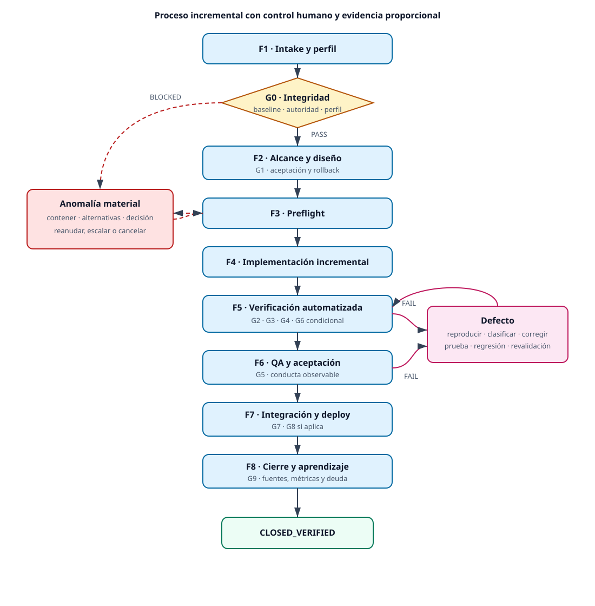

# Proceso de desarrollo y entrega

Estado: `VIGENTE` como guía proporcional para cambios futuros. El proceso fue
derivado del ciclo observado en este challenge, pero sus reglas prospectivas no
se presentan como si hubieran sido ejecutadas históricamente.

## Propósito y alcance

Se adopta un **proceso incremental asistido por IA con control humano y
evidencia proporcional**. La unidad primaria es el cambio: una necesidad se
convierte en un incremento verificable, trazable y reversible. El rigor depende
del impacto, los datos, la seguridad y la dificultad del rollback.

- [Fuente Mermaid](diagrams/development-delivery-process.mmd)
- [Diagrama SVG](diagrams/development-delivery-process.svg)
- [Diagrama PNG](diagrams/development-delivery-process.png)

## Proceso observado y aprendizajes

El ciclo histórico usó tareas numeradas, commits temáticos, alcance congelado,
pruebas automatizadas, QA manual, correcciones y reauditoría. Preservó V1,
separó el protocolo previo de los resultados y bloqueó dos defectos hasta
`CLOSED_VERIFIED`. También registró falsos bloqueos, discovery incompleto,
interferencia de Compose, contaminación de datos, fallos de Browser y un handoff
sin adjuntos.

Se conservan la trazabilidad, los gates, la historia inmutable y la capacidad de
QA para bloquear. Se corrigen los costos observados con preflights reutilizables,
una fuente de verdad por tema, contratos breves para IA y controles que sólo
existen cuando nombran un riesgo.

La evidencia completa permanece en el [registro V2](V2_EXECUTION_LOG.md), la
[retrospectiva](V2_RETROSPECTIVE.md), el
[protocolo TP-006](../testing/TP-006_TEST_PROTOCOL.md) y su
[informe](../testing/TP-006_TEST_EXECUTION_REPORT.md).

## Principios

1. Priorizar funcionalidad obligatoria y riesgo antes que extras.
2. Ajustar rigor a impacto y reversibilidad.
3. Exigir evidencia para cada `PASS`.
4. Reservar a una persona alcance, riesgo, excepciones y release.
5. Mantener una fuente de verdad por tema.
6. Separar intención, ejecución y resultado.
7. Detenerse sólo ante incertidumbre material.
8. Automatizar controles repetibles y retirar los que ya no controlan un riesgo.

## Perfiles de rigor

| Perfil | Aplicación | Evidencia mínima | Aprobación |
|---|---|---|---|
| Ligero | Cambio local, reversible, sin datos sensibles, infraestructura ni contrato material | Criterios, diff, prueba relacionada y cierre | Dueño de alcance; auto-revisión registrada admisible |
| Estándar | Feature o proyecto pequeño multicapa, QA o deploy controlado | Requisitos, diseño breve, estrategia de calidad, pruebas, revisión y release | Alcance y release identificables; revisión separada deseable |
| Reforzado | Auth, datos sensibles, migración, integración crítica o rollback difícil | Estándar más seguridad, datos, migración, rollback y operación según riesgo | Segregación y aprobaciones explícitas |

Este challenge corresponde a `Estándar`, con controles reforzados puntuales para
Docker, PostgreSQL, datos y deploy. Un cambio escala de perfil de inmediato al
aparecer un riesgo mayor; sólo puede reducirse con decisión humana registrada.

## Ciclo de vida

| Fase | Propósito y salida | Gate de salida |
|---|---|---|
| F1 Intake y clasificación | Objetivo, valor, riesgos, responsable y perfil | G0 |
| F2 Alcance, aceptación y diseño | Baseline, criterios verificables, exclusiones y rollback proporcional | G1 |
| F3 Preparación y preflight | Git, entorno, datos, permisos, red, discovery y aislamiento válidos | G0 revalidado cuando aplique |
| F4 Implementación incremental | Diff acotado, tests relacionados y commits temáticos | G2 |
| F5 Verificación automatizada | lint, tipos, build, tests, datos y seguridad aplicable | G3, G4 y G6 condicional |
| F6 QA y aceptación | Conducta observable, accesibilidad, evidencia y defectos | G5 |
| F7 Integración, publicación y deploy | Revisión, documentación vigente, PR/merge, smoke y rollback | G7 y G8 condicional |
| F8 Cierre y aprendizaje | Fuentes vigentes, evidencia histórica, métricas, deuda y acción material | G9 |

Las fases pueden fusionarse en `Ligero`, pero no se omite el riesgo que cada una
controla. Un fallo vuelve a la fase que puede corregir su causa y repite los
gates impactados.

## Estados

| Estado | Significado |
|---|---|
| `PLANNED` / `READY` / `IN_PROGRESS` | Cambio registrado, preparado o activo |
| `COMPLETE` | La tarea produjo su salida; no implica aceptación |
| `PASS` | Criterio ejecutado y satisfecho con evidencia |
| `FAIL` | Ejecución válida que no satisfizo el criterio |
| `BLOCKED` | No puede continuar o evaluarse válidamente |
| `PASS_WITH_OBSERVATIONS` | Obligatorios satisfechos; riesgo no bloqueante registrado |
| `FIXED` | Corrección aplicada, todavía sin revalidación |
| `CLOSED_VERIFIED` | Corrección o release revalidada |
| `CANCELLED` | Cierre sin entrega, preservando la historia |

`COMPLETE` no equivale a `PASS`; `FIXED` no equivale a `CLOSED_VERIFIED`; y un
caso no ejecutado nunca puede declararse `PASS`.

## Roles y control humano

| Rol lógico | Autoridad principal |
|---|---|
| Solicitante / responsable de alcance | Necesidad, prioridad, aceptación y alcance residual |
| Orquestador técnico | Perfil, secuencia, contrato de IA y condiciones de detención |
| Implementador | Diseño local, código, pruebas y documentación dentro del alcance |
| Revisor técnico / QA | Diff, contratos, comportamiento observable, defectos y recomendación |
| Aprobador de release | Riesgo residual, excepción, publicación y rollback |
| Operador | Secretos, destino, deploy, health y restauración |
| Agente IA ejecutor | Acciones acotadas y evidencia; nunca amplía alcance ni se autoautoriza |
| Agente IA revisor | Revisión separada; no edita concurrentemente el mismo workspace |

En un equipo unipersonal se separan temporalmente ejecución y revisión, se
congelan criterios, se automatizan gates y se registra la autoaprobación. Los
riesgos Reforzados pueden exigir otra persona.

## Gobernanza de IA

Toda tarea que pueda modificar artefactos declara explícitamente:

- ID, objetivo, criterio de terminado y fuentes de verdad;
- herramienta, modalidad, modelo, esfuerzo/razonamiento y velocidad;
- workspace, archivos, permisos, red y comandos autorizados;
- preflight, límites, condición de detención y regla de anomalías;
- entregables, gates y formato de devolución;
- inicio, fin, duración total y activa aproximada, intentos, correcciones,
  bloqueos, errores con causa/etapa/impacto, retrabajo, archivos, comandos y Git.

Los prompts deben enlazar fuentes versionadas y mantenerse breves. Una persona
revisa alcance, arquitectura, anomalías materiales, datos sensibles, riesgo y
release. No se editan simultáneamente los mismos archivos con dos agentes.

## Anomalías

Una anomalía es material si puede afectar datos, secretos, historia Git,
alcance, validez de pruebas, ambiente compartido, seguridad, costo autorizado o
reversibilidad.

1. Contener la operación afectada y preservar el estado.
2. Clasificar hecho, impacto y causa conocida o `UNKNOWN`.
3. Comparar alternativas por riesgo, reversibilidad, tiempo y evidencia.
4. Aplicar la solución segura más simple dentro del alcance, con un intento
   corregido por la causa observada.
5. Verificar el control afectado y registrar prevención sólo si el riesgo es
   repetible.

Una diferencia de metadata, un servicio activo o un alias conocido no bloquean
por sí solos si no contaminan el resultado.

## Gates

Se adoptan **diez gates, G0–G9**. La propuesta que originó esta guía decía
“nueve” mientras enumeraba G0 a G9; esta versión resuelve la inconsistencia
contando la enumeración real. Cada gate conserva un riesgo, evidencia y acción
de fallo distintos.

| Gate | Riesgo controlado | Evidencia mínima |
|---|---|---|
| G0 Intake e integridad | Fuente, baseline, autoridad, perfil o precondición incorrectos | Ticket y preflight/Git |
| G1 Alcance y diseño | Ambigüedad, scope creep o rollback ausente | Aceptación, exclusiones y diseño proporcional |
| G2 Implementación | Incremento incompleto o diff fuera de alcance | Diff, tests relacionados y revisión |
| G3 Calidad técnica | Código inconsistente o no construible | lint, typecheck y build |
| G4 Pruebas y datos | Regresión, discovery incompleto o baseline inválida | Inventario, resultados, migración/seed e idempotencia |
| G5 QA y aceptación | Conducta o criterio observable no satisfecho | Casos, ambiente, evidencia y defectos |
| G6 Seguridad y operación | Exposición, pérdida, migración u operación insegura | Secretos, escaneos y rollback según perfil |
| G7 Integración y documentación | Main, contrato o documentación divergentes | Revisión/PR y fuentes vigentes |
| G8 Deploy y validación pública | Release inoperable o irreversible | Versión, health, smoke y rollback |
| G9 Cierre y aprendizaje | Evidencia dispersa, deuda oculta o control sin dueño | Registro consolidado, métricas, riesgos y acciones |

## Cambios y defectos

Una corrección dentro de criterios actualiza defecto, test, commit y
revalidación. Un cambio de baseline requiere Change Request; una decisión
arquitectónica significativa requiere una decisión breve versionada. Los
cambios documentales actualizan la fuente vigente sin reescribir evidencia.

El ciclo de defecto es:

`detección → reproducción → severidad/prioridad → decisión → corrección → prueba relacionada → regresión → revalidación → cierre verificado`.

Críticos y altos bloquean; los medios bloquean cuando afectan aceptación; los
bajos pueden quedar con dueño y criterio. Un defecto sólo queda no bloqueante
si no compromete aceptación, seguridad, integridad o rollback y el aprobador
acepta el riesgo.

## Fuentes de verdad y métricas

| Tema | Fuente |
|---|---|
| Alcance y aceptación | Ticket/CR versionado |
| Arquitectura y API | Documento vigente, código, Prisma y OpenAPI |
| Pruebas | Código/configuración; informe o pipeline como evidencia |
| Defectos y decisiones | Registro único; decisión versionada según impacto |
| Deploy y release | Configuración/runbook y commit/release |
| Proceso | Este documento; logs e informes como historia |

Se registran lead/cycle time, duración activa aproximada, tiempo bloqueado,
intentos, correcciones, retrabajo, defectos, gates fallidos, pruebas por versión,
deploy/rollback, handoffs y costo IA cuando esté disponible. No se usan horas,
commits, prompts, líneas de código o cantidad de tests como productividad
individual aislada. Toda métrica ausente queda `UNKNOWN`.

## Criterios de uso y mejora

Este proceso sirve para proyectos pequeños, features multicapa, MVP y cambios
con baseline y evidencia verificable. Se subordina a políticas organizacionales
superiores y no reemplaza procesos regulados, respuesta a incidentes críticos o
investigación abierta.

Al cierre se eligen como máximo una o dos lecciones materiales. Una acción se
incorpora sólo si reduce un riesgo repetible con costo proporcionado; se prueba
en cambios comparables y se conserva, ajusta o retira según evidencia.

Decisiones organizacionales todavía abiertas: herramientas oficiales,
umbrales de perfil, incompatibilidad de roles, branch protection, autoridad
para excepciones, retención, proveedores/modelos de IA, presupuesto, política
de navegador, ventana de éxito del deploy y ownership del proceso.
